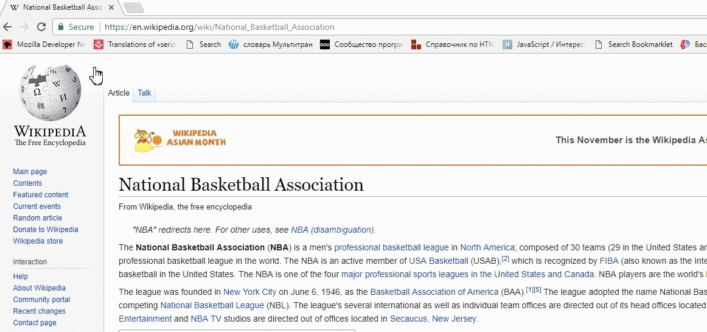

Search Bookmarklet
================================



What is that Bookmarklet in JavaScript ? <br/>
[Bookmarklet](http://en.wikipedia.org/wiki/Bookmarklet) - is a bookmark stored in a web browser that contains JavaScript commands to extend the browser's functionality.

First time when I saw this I was very excited. What it that, JavaScript in **href** attribute, asked myself ! )<br/>
Guys who tell me that is old version to include JavaScript for **html** tags. <br/>
But, when I read more about that I thought and decided that it very cool think.<br/>
And I decided to create **Search Bookmarklet**.<br/>

First what you should know it's how write bookmarklet on **html** tags:<br/>

key word is **javascript:**<br/>

1.An anonymous function:
```javascript
javascript:(function () {
  // code...
})();
```
For example:
```html
<a href="javascript:(function () { alert('Work') })();">Alert</a>
```
2.If script includes a function definition/redefinition, you should add suffixed **void(...);**
```javascript
javascript:{ script );void(0);
```

Let's start write code. We used **anonymous function**.<br/>

#### What functionality "Bookmarklet Search" has:
- you may select any text on page and you should see button "Search". When you have click to "Search" you will go to another page where your text open in **google/search**.

> Code you may see in **index.html** or **bookmarklet.js** files.

From **bookmarklet.js** file you may copy code and create **BOOKMARKS** in any browser what you want:<br/>
#### For ex. Google Chrome steps:
- Click Bookmarks->Bookmark Manager;
- Click the "Organize" link, then "Add Page" in the drop down;
- You should see two input fields. Type the name of the bookmark .Paste the javascript code below into the second field.

After that you may use it.

Information
============
If you have some questions, problems or improvement for this bookmarklet create issues and we will discuss.<br/>
Thank you!

License
========
[MIT License](http://opensource.org/licenses/mit-license.php)
